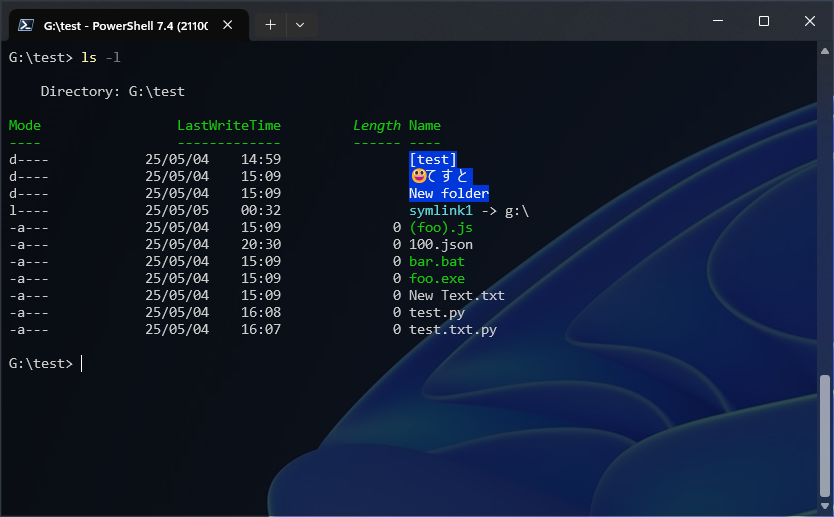
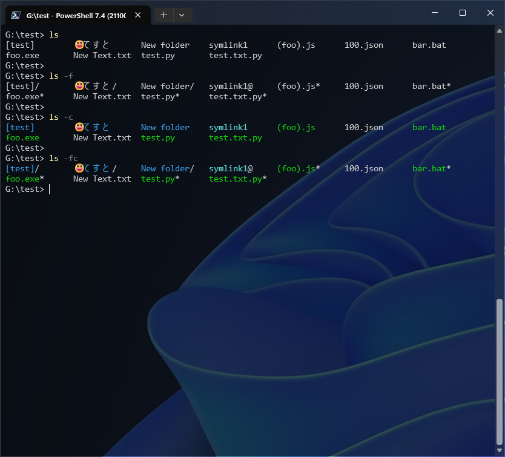
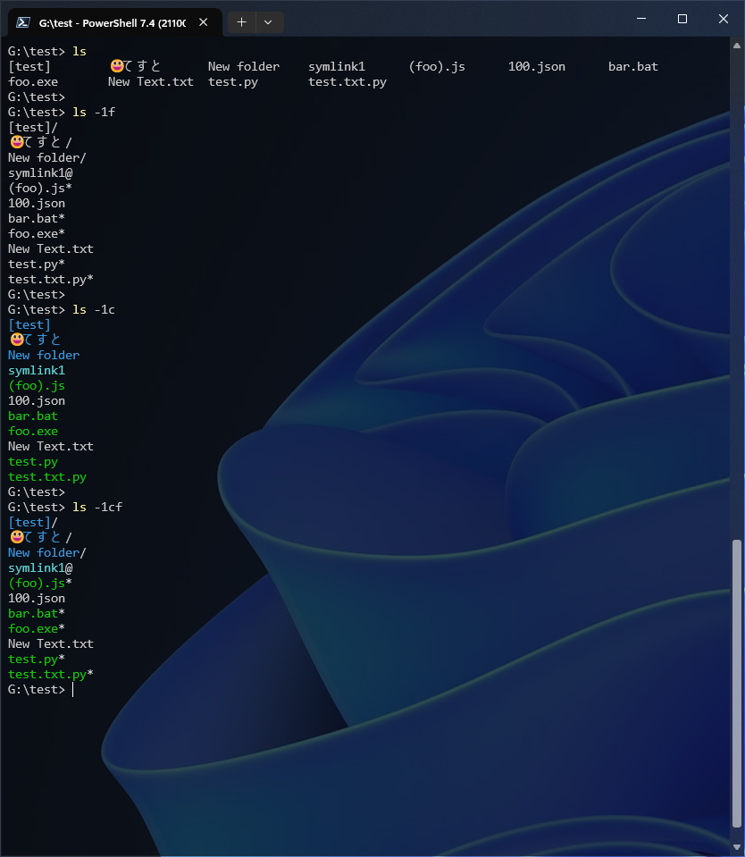

# bash like ls for powershell

## What is this?
  * `ls` function for powershell with bash's `ls` like output. 
    - you can use `-1`, `-c`, `-f` options.
    - with `-l` option, simply returns powershell's default `ls` (`Get-ChildItem`) result .






## Description
```
bash-like-ls

Options:
-1     list one file per line
-f,F   append indicator (one of */@) to entries
-c,C   color the output.
-l,L   simply passes through to pwsh's default ls (Get-ChildItem).
       this option will be preferentially applied.
--help display this help message

Notice:
For redirect or pipe, you must use with the pass through option (-L)
or -1 without -F, -C option. 
When used with -L option, this function simply calls Get-ChildItem,
so returns an array of FileSystemInfo objects.
When used with -1 option, this function returns a string array of the
file names.

Version : 1.0.1
Author: knhcr
```


## Install
  * Place the `bash-like-ls.ps1` file anywhere you like.
  * Add below into the PowerShell's profile file (`$profile`).
    - Don't miss the first `.` and the white space.

```ps1
. "<ABSOLUTE_PATH_TO>\bash-like-ls.ps1"
Remove-Item Alias:ls -ErrorAction SilentlyContinue
Set-Alias -Name ls -Value Bash-Like-LS
```

  * Hint.
    - The `$profile` file may be in the path below, I think. (You can know it by just typing `$profile` in your PowerShell)
      + [PS 5] `C:\Users\<USER_NAME>\Documents\WindowsPowerShell\Microsoft.PowerShell_profile.ps1` 
      + [PS 7] `C:\Users\<USER_NAME>\Documents\PowerShell\Microsoft.PowerShell_profile.ps1`


## Uninstall
  * Delete `bash-like-ls.ps1` file, and remove the line you write into your `$profile`.


